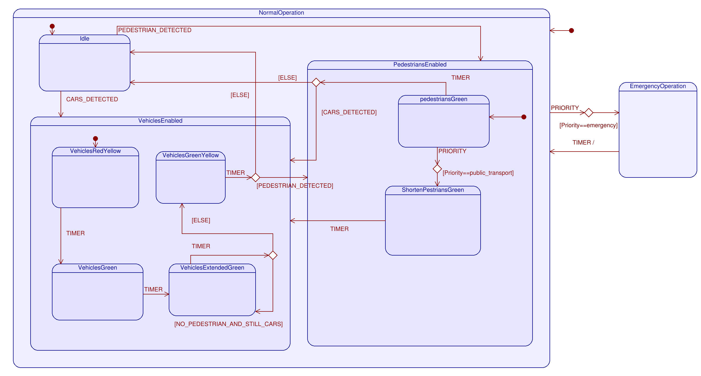
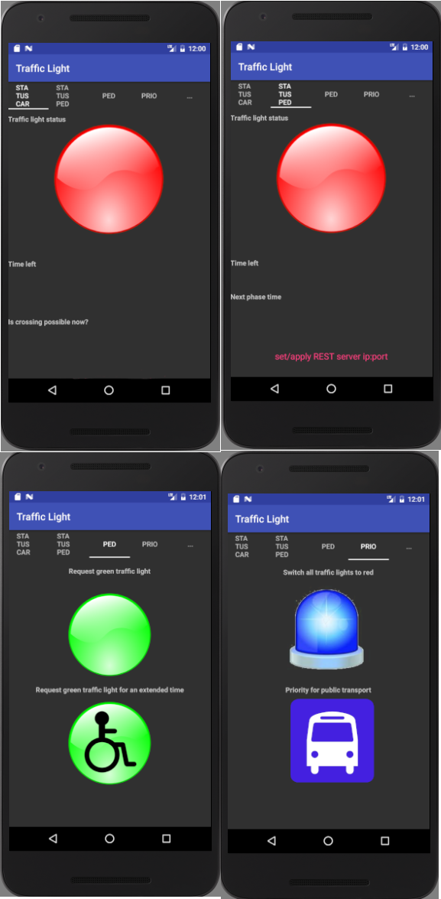
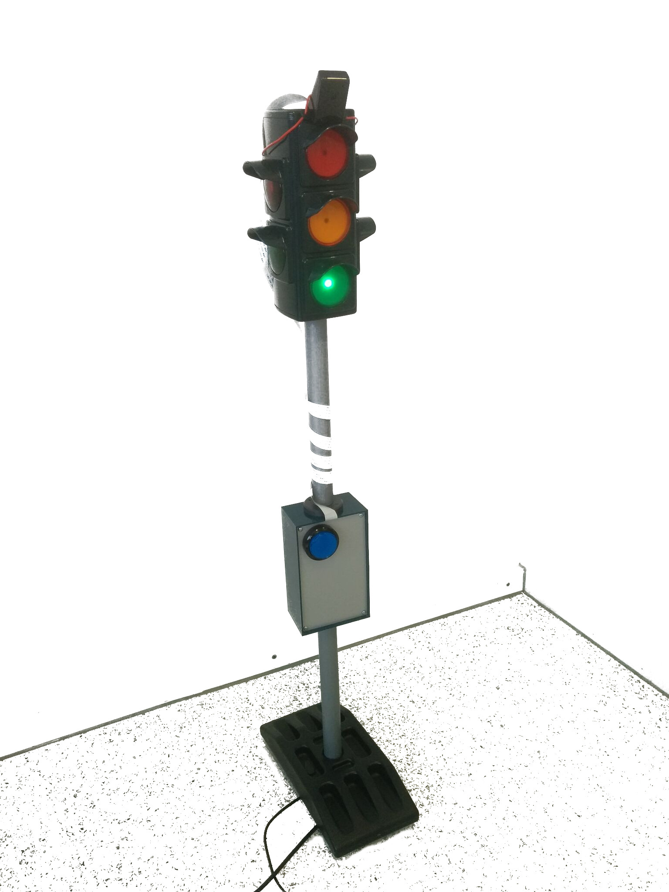

# V2I-Traffic-Light-Demonstrator
V2I Traffic Light Demonstrator (vehicle-to-infrastructure communication)

01.2017, Embedded Computing Master @ Munich University of Applied Science [MUAS](https://www.hm.edu/en/index.en.html)

[Project webpage](https://shreaker.github.io/V2I-Traffic-Light-Demonstrator/)

## Thesis
[Thesis](Thesis_Presentation/thesis.pdf)

## Use cases
[Use case](Thesis_Presentation/usecases.pdf)

## Presentation
[Presentation](Thesis_Presentation/Presentation.pdf)

## Raspberry / Traffic Light Application
Steps for building the traffic light application:

0. (Get a Debian based host system, we used Ubuntu 16.04)
1. Get the Linaro toolchain for ARM [gcc-linaro-4.9-2016.02-x86_64_arm-linux-gnueabihf](https://releases.linaro.org/components/toolchain/binaries/4.9-2016.02/arm-linux-gnueabihf/gcc-linaro-4.9-2016.02-x86_64_arm-linux-gnueabihf.tar.xz)
2. Extract it somewhere
3. Look into the build script *Raspberry_App/toolchain-build/cross-compile-libs.sh*
4. It has no error checking, so it's not meant to be run as a whole.
5. Adjust the parameters at the beginning according to your system and run the commands one by one.
6. You should now have a Raspbian image in /tmp. Store it somewhere, where it won't get deleted
7. Use *Raspberry_App/toolchain-build/mount-raspbian.sh* to mount it
8. Use CMake for building:
```
cd Raspberry_App/TrafficLight
mkdir build && cd build
cmake -D CMAKE_TOOLCHAIN_FILE="/path/to/rpi-toolchain.cmake" -D PIROOT="/path/to/rasp-pi-rootfs" -D TOOLCHAIN="/path/to/gcc-linaro-4.9-2016.02-x86_64_arm-linux-gnueabihf" ..
make
```

- For the configuration of Wifi (password), network etc. see cross-compile-libs.sh

### Statemachine Raspberry App


## Android App / Interacting with Traffic Light Application
- Optimized for 5.2" 1920 × 1080 Pixel (e.g. Nexus 5X)
- Android version 6, 7 or higher required
- Build with Android Studio 
- Screenshot:



## Demonstrator


